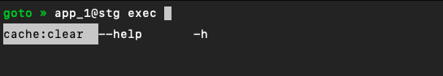

# Goto

Interactive shell for quick SSH access to application servers/environments via simple configuration file.





## Installation

### Binary

You can download the binary from the releases page on Github and add to you `$PATH`.

DEB and RPM packages are also available.

The `checksums.txt` file contains the SHA-256 checksum for each file.

### Install Script

We also have an install script which is very useful in scenarios like CI. Many thanks to GoDownloader for enabling the easy generation of this script.

By default, it installs on the ./bin directory relative to the working directory:

```shell
sh -c "$(curl --location https://github.com/rguennichi/goto/raw/main/install.sh)" -- -d
```

It is possible to override the installation directory with the `-b` parameter. 
On Linux, common choices are `~/.local/bin` and `~/bin` to install for the current user or `/usr/local/bin to install for all users:

```shell
sh -c "$(curl --location https://github.com/rguennichi/goto/raw/main/install.sh)" -- -d -b ~/.local/bin
```

## Getting started

Create a file called `goto.yaml` in the directory where `goto` binary resides (eg: `~/.local/bin/goto.yaml`).

If you want to save your `goto.yaml` config file to custom location, in that case you must run `goto`
with the `--config=/path/to/goto.yaml` flag.

```shell
# By default, goto will try to search for goto.yaml file in the same directory (~/.local/bin)
$ goto
             _           
  __ _  ___ | |_ ___     
 / _` |/ _ \| __/ _ \  
| (_| | (_) | || (_)     
 \__, |\___/ \__\___/
 |___/                   

goto »  app_1@stg exec cache:clear
```

```shell
# By default, goto will try to search for goto.yaml file in the same directory (~/.local/bin)
$ goto --config=/path/to/goto.yaml
```

### Configuration example

```yaml
version: 1

servers:
  server_1: &server_1
    username: 'joe'
    port: 22
    environments:
      stg:
        hosts: ['i1.stg.server1.example', 'i2.stg.server1.example']
      prod:
        hosts: ['i1.prod.server1.example', 'i2.prod.server1.example']
  server_2: &server_2
    username: 'joe'
    port: 22
    environments:
      stg:
        hosts: ['i1.stg.server2.example', 'i2.stg.server2.example']
      prod:
        hosts: ['i1.prod.server2.example', 'i2.prod.server2.example']

applications:
  app_1:
    server: *server_2
    username: 'org-app-1'
    path: '/home/org-app-1/deployer/current'
    scripts:
      - &cache-clear {name: 'cache:clear', exec: 'bin/php bin/console cache:clear'}
  app_2:
    server: *server_1
    username: 'org-app-2'
    path: '/home/org-app-2/deployer/current'
    scripts:
      - *cache-clear
  app_3:
    server: *server_2
    username: 'org-app-3'
    path: '/home/org-app-3/deployer/current'
    scripts:
      - *cache-clear
      - { name: 'generate:file', exec: 'bin/php bin/console generate:file' }
      - { name: 'killall-php', exec: 'killall php8.1' }
  app_4:
    server: *server_1
    username: 'org-app-4'
    path: '/home/org-app-4/deployer/current'
```